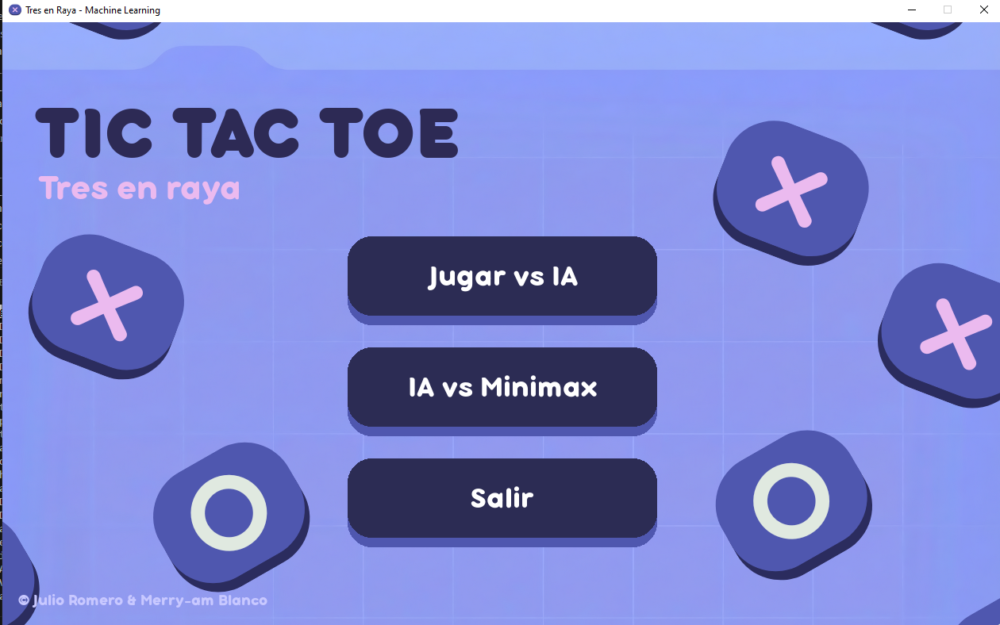
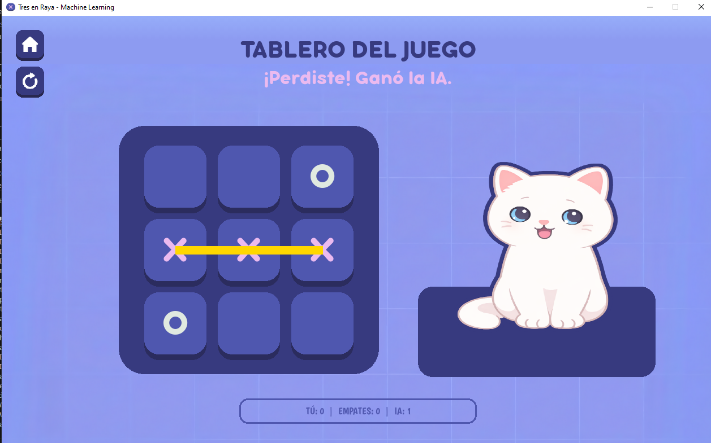
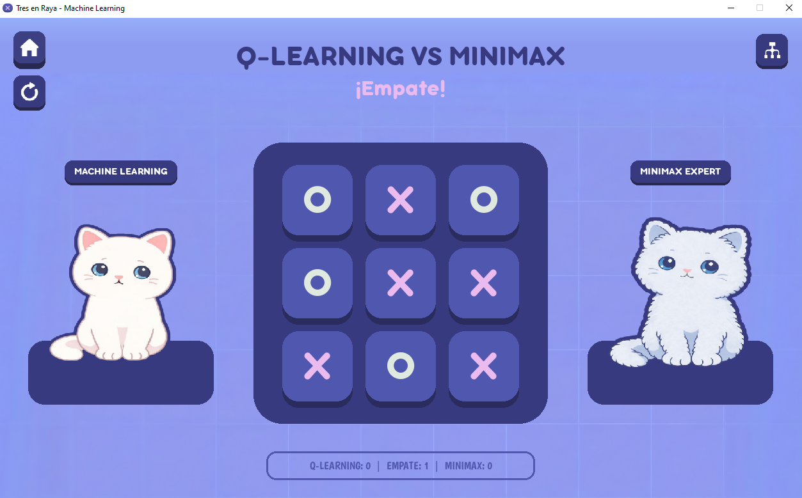
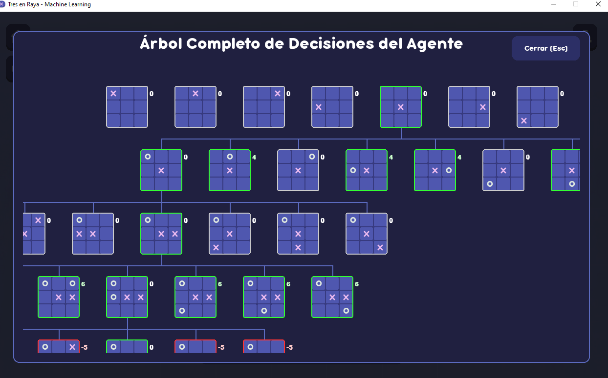

# 🧠 Tres en Raya (Tic-Tac-Toe) con Agente Machine Learning


> **TRES EN RAYAS:** Enfréntate a una Inteligencia Artificial de Machine Learning y observa cómo compite contra el agente Minimax

---

## 📸 Galería

| Menú Principal | Juego Modo Humano Vs Agente |
|:---:|:---:|
|  |  |

| Juego Modo Agente QL Vs Agente Minimax | Modal del árbol de decisiones |
|:---:|:---:|
|  |  |

---

## ✨ Características Principales

### 🤖 Agente de Inteligencia Artificial
*   Implementación del algoritmo **Q-Learning** entrenada mediante aprendizaje por refuerzo.
*   La IA juega de forma óptima: siempre buscará ganar o, en el peor de los casos, forzar un empate. ¡Intenta ganarle si puedes!

### 🎨 Interfaz Gráfica 
*   Diseño estilo *cartoon* con colores modernos (paleta morada/azul).
*   **Botones interactivos:** Efectos de elevación, sombras y sonidos al pasar el mouse.
*   **Feedback visual:** Animaciones al colocar fichas y línea dorada al ganar.
*   **Avatar:** Los agentes de inteligencia artificial se muestran en pantalla como gatos.

### 🐱 Modo de Juego
*   **Humano Vs Agente ML:** Juega contra un agente de inteligencia artificial entrenado por aprendizaje por refuerzo.
*   **Agente ML vs Agente Minimax:** Observa cómo juegan dos agentes de inteligencia artificial entrenados para jugar de la manera más óptima posible; observa al final el árbol de decisiones de cada una de sus jugadas.

---

## 🚀 Instalación y Ejecución

Sigue estos pasos para probar el proyecto en tu máquina local:

1.  **Clonar el repositorio:**
    ``` bash
    git clone https://github.com/Jumicode/Agente-tres-en-raya-q-learning
    cd agente-tres-rayas-q-learning
    ```

2.  **Crear un entorno virtual (Opcional pero recomendado):**
    ``` bash
    python -m venv venv
    source venv/bin/activate  # En Windows: venv\Scripts\activate
    ```

3.  **Instalar dependencias:**
    Solo necesitas `pygame`.
    ``` bash
    pip install pygame
    ```

4.  **¡Jugar!**
    ```
    python main.py
    ```    
---

## 📊 ¿Cómo puedes entrenar al Agente?

1.  **Elimina el archivo "conocimiento_gato.json**

2.  **Ejecuta el comando para entrenar al agente desde la raíz del proyecto**
    ``` bash
    python -m game.trainer
    cd agente-tres-rayas-q-learning
    ```
3.  **En consola podrás observar el tiempo y cómo se entrenó el agente**

4.  **Podrás generar un reporte en html del entrenamiento del agente ejecutando el comando:**
    ``` bash
    python generar_reporte.py
    cd agente-tres-rayas-q-learning
    ```
5.  **Abre el archivo "REPORTE_CEREBRO_AI.html en tu navegador**

---

## 📂 Estructura del Proyecto

El código está modularizado para mantener el orden y la escalabilidad:

```text
agente-tres-rayas-q-learning/
├── 📂 assets/          # Imágenes, fuentes (.ttf) y sonidos (.wav/.mp3)
├── 📂 game/            # Lógica del juego
│   ├── ai.py           # Algoritmo q-learning, minimax y generación de árboles
│   ├── logic.py        # Reglas del Tres en Raya
│   └── trainer.py      # Módulo para entrenar al Agente Q-Learning
├── 📂 ui/              # Interfaz de Usuario
│   ├── assets.py       # Funciones para cargar recursos (Fuentes, Sonidos, etc.)
│   ├── config.py       # Colores y constantes
│   ├── components.py   # Elementos reutilizables (mini tableros, botones)
│   ├── interface.py    # Pantalla principal del juego
│   ├── menu.py         # Menú principal animado
│   ├── help.py         # Pantalla de "Cómo jugar"
│   └── events.py       # Manejo de inputs del usuario
├── conocimiento_gato.json # Archivo de memoria del Agente Q-Learning
├── generar_reporte.py  # Genera el HTML con el resultado del entrenamiento
└── main.py             # Punto de entrada y bucle del juego           
```

## 🧠 ¿Cómo funciona el algoritmo?

A diferencia de los algoritmos de búsqueda tradicionales como Minimax, este proyecto implementa un agente de Aprendizaje por Refuerzo (Reinforcement Learning) que no conoce las reglas del juego de antemano, sino que las descubre a través de la experiencia.

1. El agente no genera un árbol de búsqueda exhaustivo. En su lugar, utiliza una Tabla Q (Q-Table), que actúa como una "memoria" donde almacena qué tan buena es cada acción para cada estado posible del tablero.
2. Utiliza la Ecuación de Bellman como motor de aprendizaje. Cada vez que el agente realiza un movimiento y recibe una recompensa, utiliza esta fórmula matemática para actualizar el valor de esa jugada en su memoria, considerando tanto el beneficio inmediato como la promesa de ganar en el futuro.
3. Posee un Sistema de Recompensas, donde el agente es entrenado mediante un sistema de estímulos:
   * +10 puntos por ganar (fomenta la ofensiva).
   * +5 puntos por empatar (fomenta la defensa sólida).
   * -10 puntos por perder (penaliza errores críticos).
4. Dilema Exploración vs. Explotación (Epsilon-Greedy):
   * Exploración: Al inicio del entrenamiento, el agente realiza movimientos al azar para descubrir nuevas jugadas.
   * Explotación: Conforme acumula experiencia, el agente reduce su curiosidad y comienza a "explotar" su memoria, eligiendo siempre la jugada con el Valor Q más alto.
5. El agente se ve sometido a un Entrenamiento Masivo de 10,000 episodios (partidas), permitiéndole alcanzar un estado de racionalidad perfecta donde es capaz de empatar siempre contra un algoritmo Minimax y derrotar sistemáticamente a jugadores humanos.


## 👥 Créditos
Desarrollado por:
- [Merry-am Blanco](https://github.com/merychi)
- [Julio Romero](https://github.com/Jumicode)